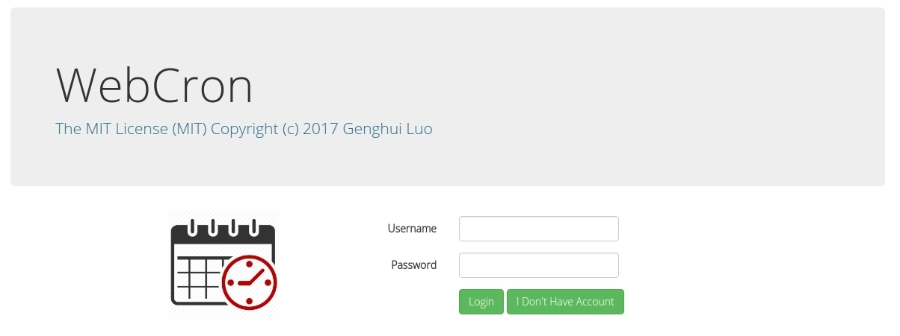
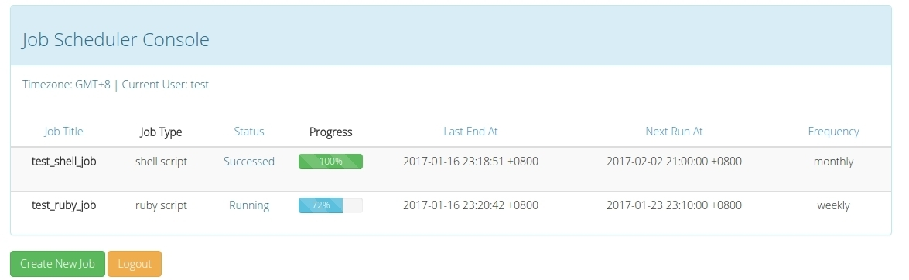
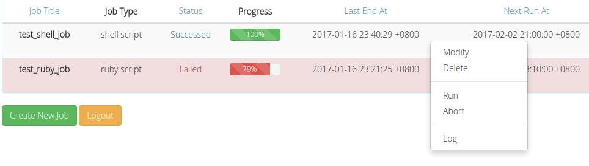
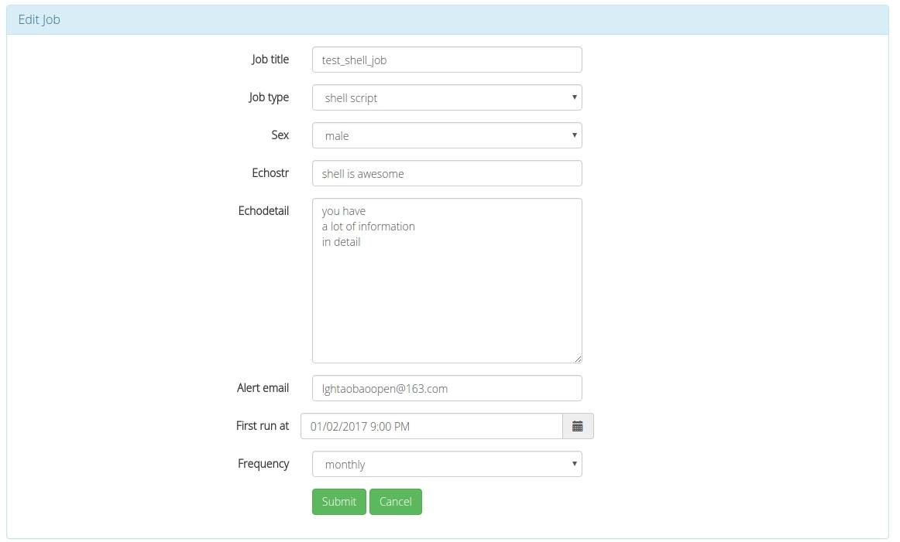
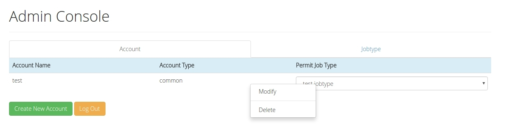
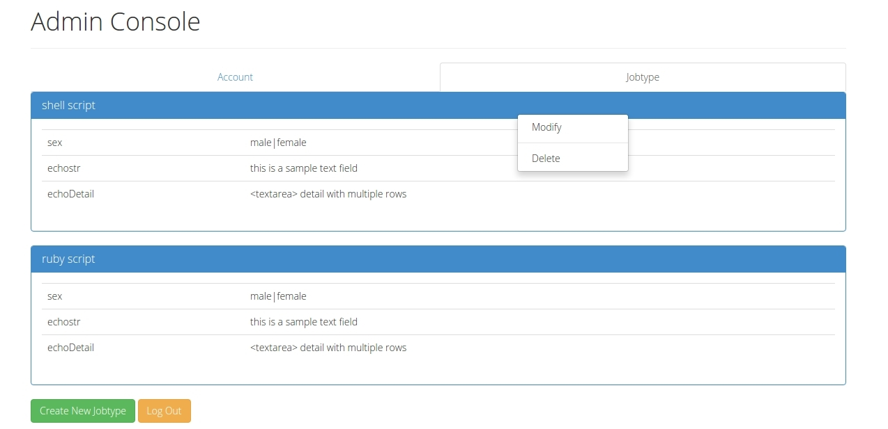
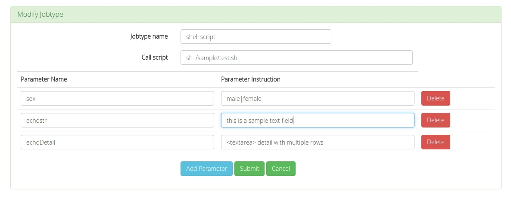
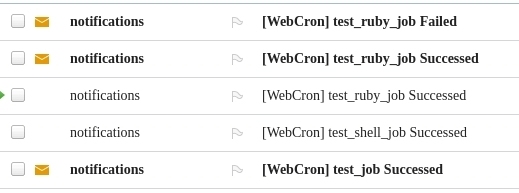

# WebCron: Crontab on Rails
- A rails web application to schedule job, reply on linux crontab
- The MIT License (MIT) Copyright (c) 2017 Genghui Luo 
- Dependencies:
  - ruby, >= 2.2
  - rails, >= 4.2
  - mysql, >= 14.14
  - node, >= 6.9

## deployment
```
> git@github.com:genghuiluo/webcron.git
> cd  ./webcron
> bash setup.bash

# config PATH in crontab
> crontab -e
# basiclly, you can add "PATH=$PATH:/usr/bin/:/usr/local/bin"

> rails s
# you can also specify domain/port with -b/-p option
# e.g. rails s -b my_webcron.com -p 8080
```

Access http://localhost:3000 (default) in your browser, You will see this login page first.


## usage
#### A) login as common user, manage jobs
> test/1234



1. right click on **each job**, click 'Modify'
  
2. select a *first run time*, update *alert email*, click 'Submit'
  
3. after modified two sample jobs, check your output of "crontab -l"

  ```
  > crontab -l
  ...
  PATH=$PATH:/usr/bin/:/usr/local/bin

  14 18 7 * * cd /webcron && /usr/local/bin/rake RAILS_ENV=development webcron:excutejob[1] >>/tmp/webcron.development.log 2>&1
  14 18 * * 2 cd /webcron && /usr/local/bin/rake RAILS_ENV=development webcron:excutejob[2] >>/tmp/webcron.development.log 2>&1
  ```
  
#### B) verify your deployment
1. Right click on one sample job, click 'Run' to manually run this job. Check if job can be excuted successfully, and also check if you received the alert email.
2. Select a proper *first run time*(e.g. after 1 min) to verify if schedule works.

#### C) login as admin, manage accounts
> admin/1234



switch to job protype tab


you can also define your own job protype


#### D) alert email sample

